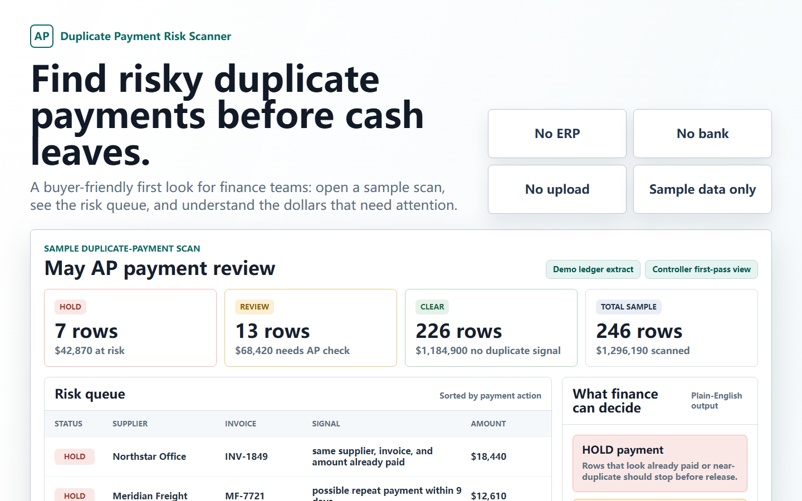

# OpsProof 本地应付扫描器

[](https://github.com/SimpleZion/opsproof-local-ap-scanner/actions/workflows/smoke.yml)

OpsProof Local AP Scanner 是一个本地优先的应付账款付款前复核工具。它用于在付款批次放行前，检查 CSV 导出中的重复付款、供应商/收款方别名、历史已付款匹配、字段映射置信度和规则就绪情况。



## 这是什么

这是一个静态浏览器工具。你可以直接打开 `index.html`，先用模拟数据、脱敏数据或仅表头做检查，再决定是否需要更完整的自助工具包或字段映射服务。

开源版本的目标是让 AP 团队在使用自己的导出结构前，先确认工具的本地运行边界、无上传边界和可解释输出。

第一条路径不需要 Python、不需要 ERP 登录、不需要银行连接，也不需要把付款数据上传到云端。

## 快速开始

1. 下载或克隆本仓库。
2. 用 Chrome 或 Edge 直接打开 `index.html`。
3. 点击 `Load demo samples and run`。
4. 查看 HOLD / REVIEW / CLEAR 队列。
5. 下载 CSV 或 HTML 报告。

也可以先查看内置模拟报告：

- [英文样例报告](sample_output/sample_duplicate_payment_risk_report.html)
- [中文样例报告](sample_output/sample_duplicate_payment_risk_report_zh.html)

商业入口：

- 官网：[tools.simplezion.com](https://tools.simplezion.com/)
- 免费验证包：[Payhip free pack](https://payhip.com/b/6UYfe)
- 付费自助包：[Payhip USD49 bundle](https://payhip.com/b/n6oUD)
- 字段映射与首次运行服务：[AP CSV Mapping & First-Run Review](https://tools.simplezion.com/setup-service/)

## 支持哪些输入

- 当前付款批次 CSV。
- 可选的已付款历史 CSV。
- 可选的供应商别名 CSV。
- 不提供明细行时的字段表头检查。
- 英文字段。
- 中文字段，包括 `供应商名称`、`往来单位名称`、`采购发票号`、`本次付款金额`、`业务日期`、`付款申请单号` 等常见中国式导出字段。

## 内置检查

- 当前付款批次中的完全重复发票。
- 去除标点、大小写和空格后的规范化发票号匹配。
- 同供应商、同金额、近日期付款复核。
- 当前付款批次重复行签名。
- 提供已付款历史时的历史付款比对。
- 供应商/收款方别名复核。
- 本地可解释异常信号，但这些信号不会覆盖确定性的 HOLD / REVIEW / CLEAR 结论。

## 隐私边界

本仓库的核心设计是本地优先：

- 不需要 ERP 登录。
- 不需要银行连接。
- 不需要账号登录。
- 扫描流程不需要云端上传。
- 不写入本地存储。
- 页面启动后会阻止网络 API 调用。

请优先使用模拟数据、脱敏数据或仅字段表头。不要在公开 issue 中粘贴真实供应商、银行、税务、工资、客户或支付卡信息。

## 测试

运行：

```powershell
npm test
```

测试会验证中英文字段映射、中文供应商名称规范化、HOLD / REVIEW / CLEAR 输出、报告生成和本地信号证据契约。

## 开源边界

本仓库是开源验证层。它本身应该可用，但不是完整商业版 AP 复核流程。

付费/商业部分可能包括更完整的复核包、字段映射服务、首次运行就绪说明、客户私有字段映射、高级规则包、顾问工作流材料和支持。

详见 [商业边界](docs/commercial-boundary.md)。

## 非会计意见

本工具不是会计审批流、审计意见、欺诈保证、付款审批系统、ERP 连接器、银行连接器，也不是法律或税务服务。它生成的是供人工 AP 复核使用的证据。
